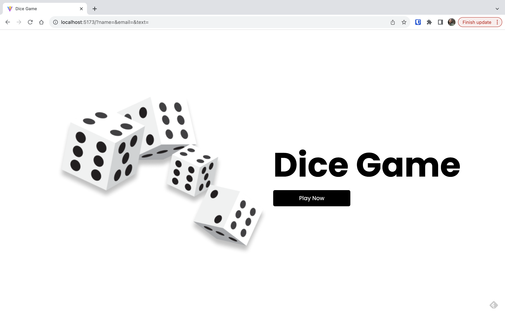
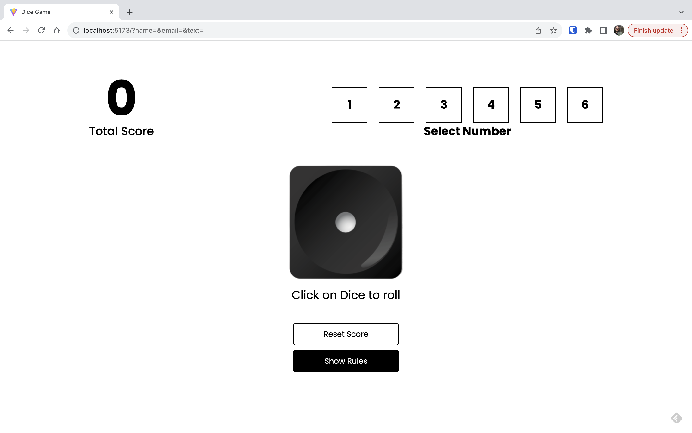
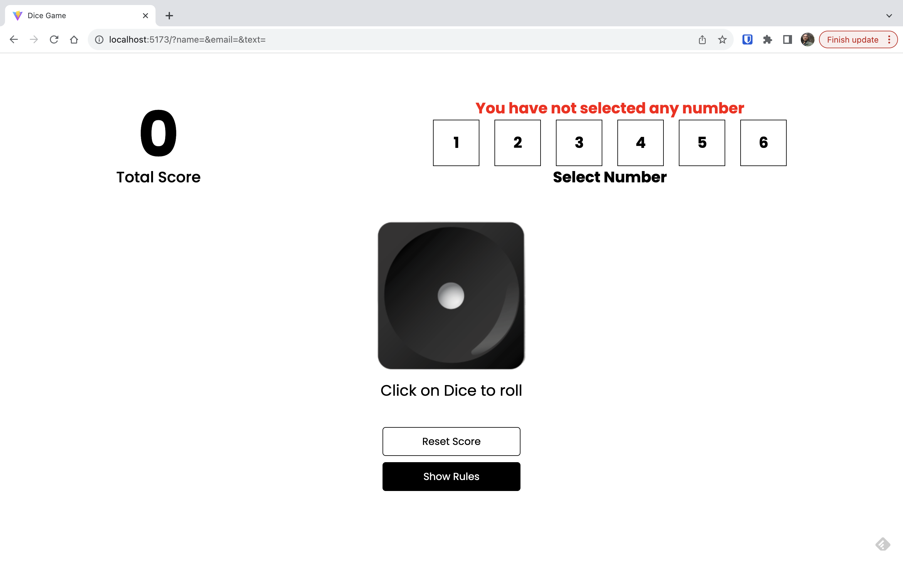
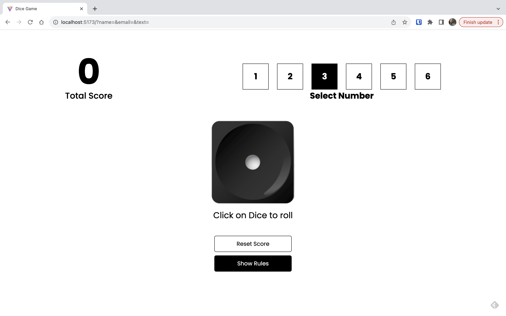
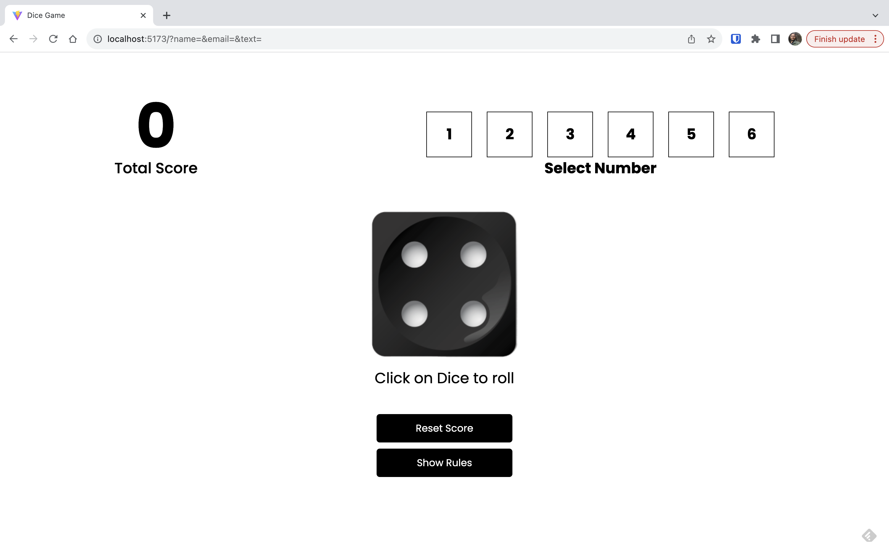
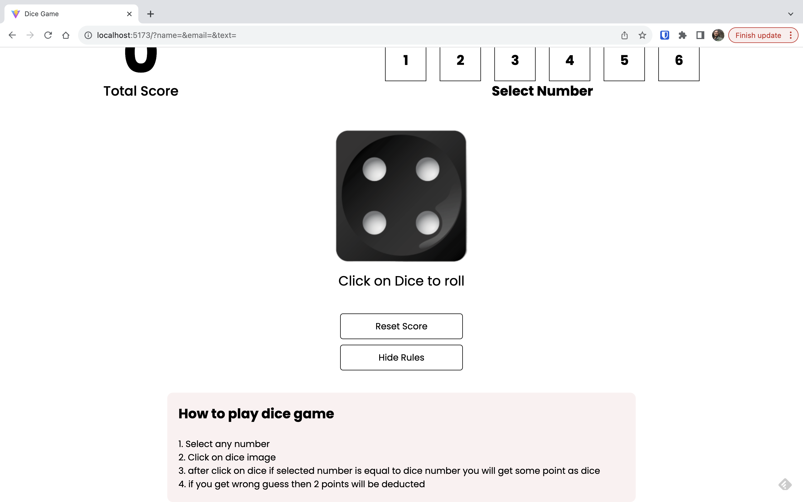

Hi 👋,
Welcome to the React Dice Game repository! This is a fun and interactive dice game built using ReactJS. Roll the virtual dice and test your luck to see if you can win big!

Features:

1. Realistic Dice Rolling: Experience the thrill of rolling virtual dice just like in a physical board game.
2. Easy-to-Use Interface: A user-friendly interface makes it simple for players of all ages to enjoy the game.
3. Random Outcomes: The game generates random dice values for a fair and exciting gameplay experience.
4. Responsive Design: Enjoy the game on various devices, from desktop to mobile, without any loss of functionality.
5. Getting Started:
    To start playing the React Dice Game, follow these steps:
     1. Select any number
     2. Click on dice image
     3. after click on dice if selected number is equal to dice number you will get some point as dice
     4. if you get wrong guess then 2 points will be deducted
     5. You can restart the game by clicking on the "Reset Button".
  
This project has been developed with the use of <b>ReactJS library</b>, <b>Vite</b> and <b>Styled-components</b>.

#### React Dice Game App Screenshots

<table>
  <tr>
    <td>First Screen Page</td>
     <td>Game start page</td>
  </tr>
  <tr>
    <td></td>
    <td></td>
  </tr>
 </table>
 <table>
  <tr>
    <td>On clicking dice without selecting number</td>
     <td>Clicked on selected number (Here it is 3)</td>
  </tr>
  <tr>
    <td></td>
    <td></td>
  </tr>
 </table>
 <table>
  <tr>
    <td>Click on Dice to test your luck (Unlucky! it is 4)</td>
     <td>Click on "Reset Score" button to reset the game</td>
  </tr>
  <tr>
    <td></td>
    <td></td>
  </tr>
 </table>
 <table>
  <tr>
    <td>Show rules by Clicking on "Show Rules" button</td>
  </tr>
  <tr>
    <td></td>
  </tr>
 </table>

 Thanks for stopping by 🤝. Ping me if you see any improvement points in this app.
